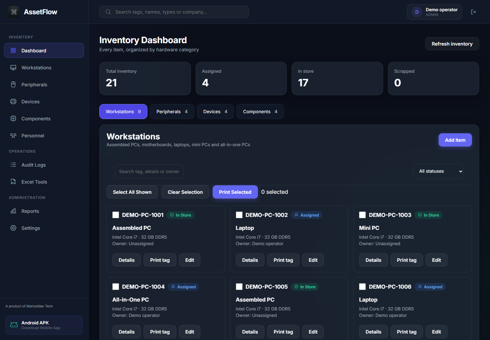
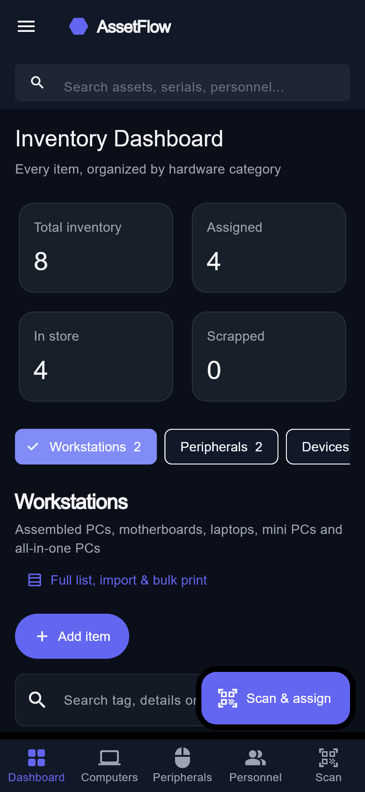
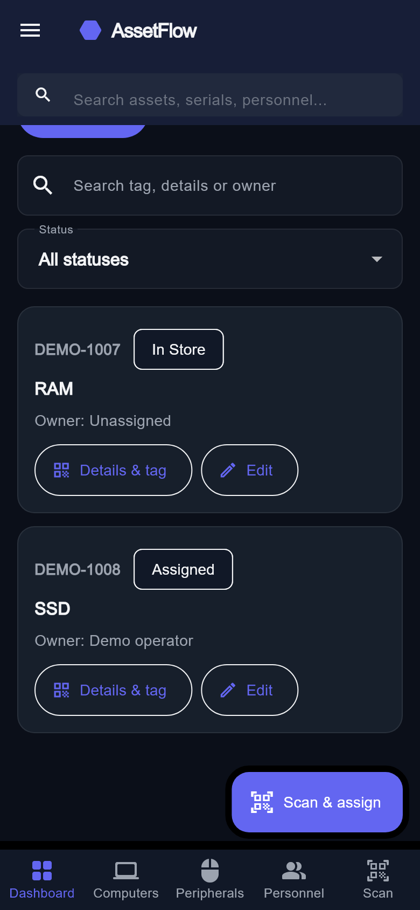
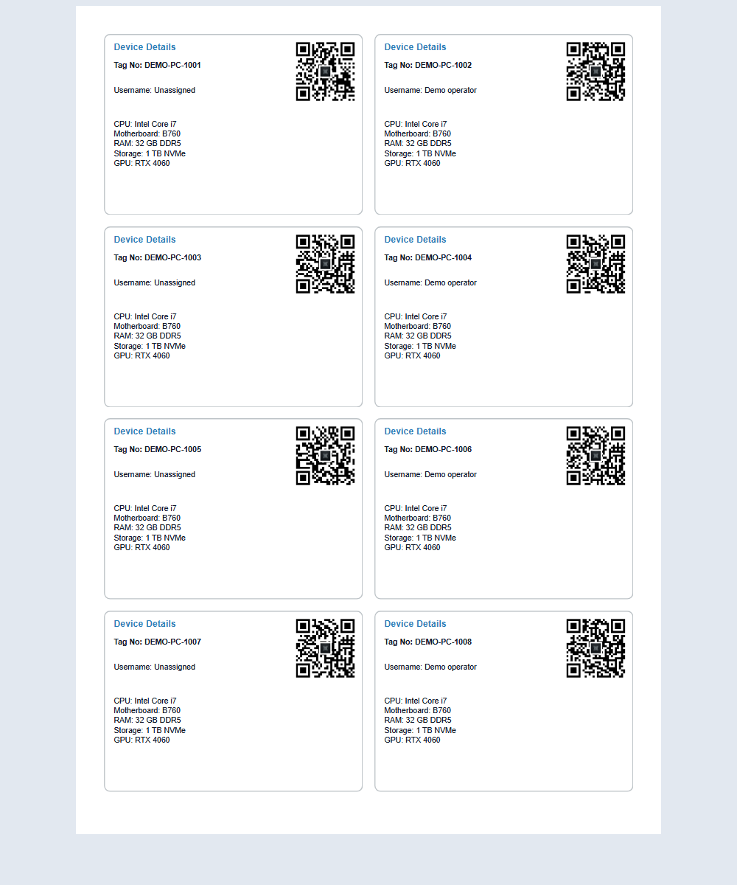
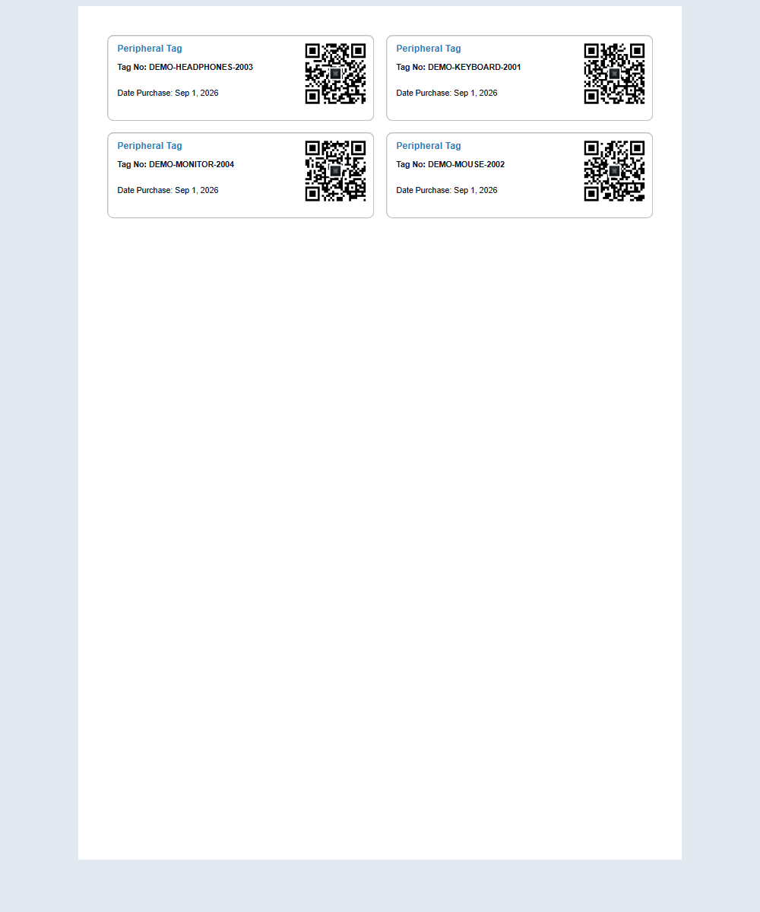
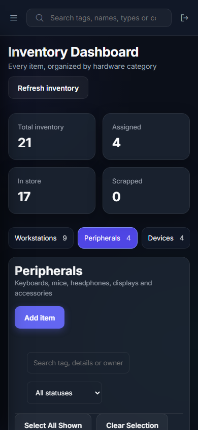

# AssetFlow 1.2.0 reference screenshots

These screenshots contain synthetic demonstration records, not client inventory. Desktop and tag screenshots come from the running web application. The mobile screenshot is rendered from the actual Flutter MainLayout and dashboard in the test harness at a 390 × 844 logical-pixel phone size.

Compact default labels print at 100% on A4: 8 workstation labels or 16 accessory labels per page. The peripheral screenshot uses four example records; additional labels fill the remaining rows. Keep browser headers/footers disabled. Larger custom tag designs remain available in Settings.
